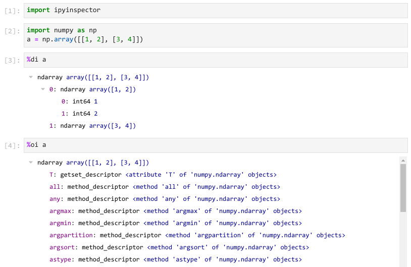

# ipyinspector

Inspect Python objects and data as an expandable tree widget.

## Installation

Install via pip from GitHub with

    pip install git+https://github.com/allefeld/ipyinspector.git

## Usage

In an environment that supports Jupyter Widgets, import the package

    import ipyinspector

and then use the line magics

    %oi expression

and

    %di expression

to create an `ObjectInspector` or a `DataInspector`, respectively, for the value of the expression. Omitting the expression creates an inspector for all elements of the current namespace.

Both `ObjectInspector` and `DataInspector` are tree widgets based on [`ipytree`](https://github.com/QuantStack/ipytree) with expandable nodes. When selected and the respective element has subelements, subnodes are created. An `ObjectInspector` allows to inspect the members (attributes and methods) of a Python object, while a `DataInspector` allows to inspect its data substructures (e.g. the elements of a list, or the subarrays of a NumPy `ndarray`).

***

This software is &copy; Copyright 2020 Carsten Allefeld and released under the terms of the GNU General Public License, version 3.